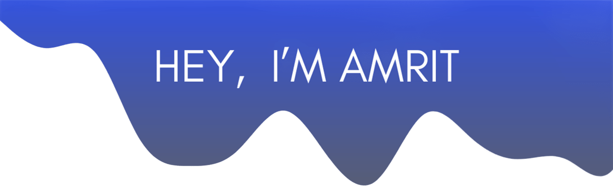

### I’m passionate about coding and developing smart systems. My main focus is on .NET, building APIs, and Blazor applications, along with working on embedded systems. I enjoy automating tasks and creating efficient solutions.

 

<!--
Here are some ideas to get you started:

- 🔭 I’m currently working on ...
- 🌱 I’m currently learning ...
- 👯 I’m looking to collaborate on ...
- 🤔 I’m looking for help with ...
- 💬 Ask me about ...
- 📫 How to reach me: ...
- 😄 Pronouns: ...
- ⚡ Fun fact: ...
-->
### ⚡ Fun fact:
- #### 👯 I’m looking to collaborate on projects using .NET, Blazor, and embedded systems.
- #### 🌱 I’m currently exploring Neovim and IoT systems as fun projects.
- #### ✏️ I focus on writing clean code and building APIs, smart devices, and scalable applications.
 

#### Let's Connect :coffee:

	
	
	<!--  -->
	<!--  -->
	<!--  -->

